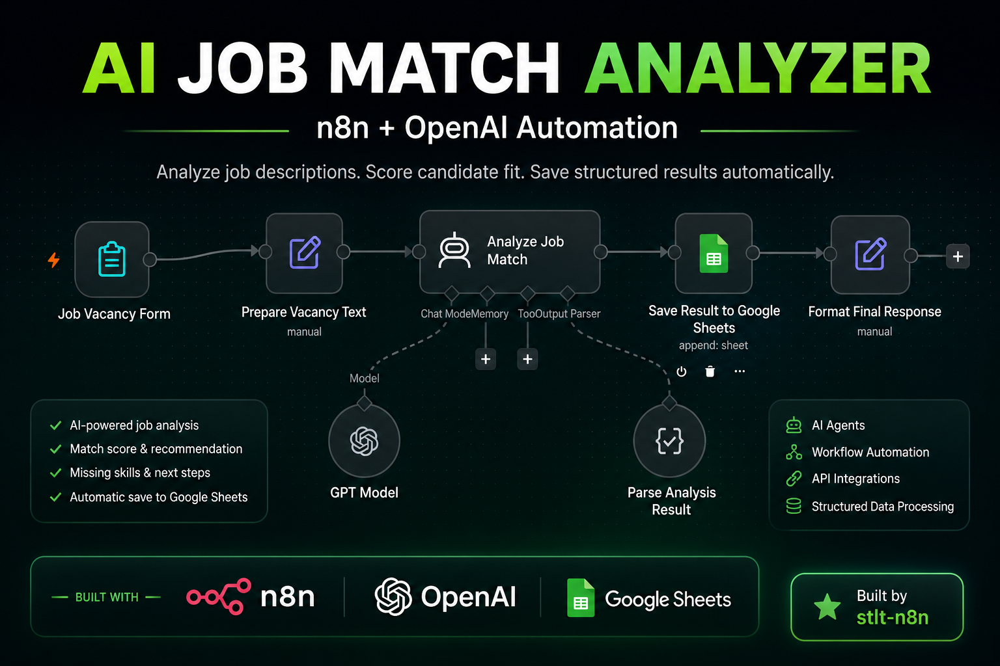

# AI Job Match Analyzer

An AI-powered n8n workflow that analyzes job vacancies, evaluates candidate fit, and saves structured results to Google Sheets.

## Overview

This workflow helps job seekers quickly evaluate whether a vacancy matches their profile. The user pastes a job description into a simple form, and the workflow uses AI to analyze the vacancy and return a structured recommendation.

## How It Works
### Workflow

1. The user submits a job vacancy through an n8n form.
2. The vacancy text is prepared for AI analysis.
3. An AI agent compares the vacancy with the candidate profile.
4. The result is converted into structured data.
5. The analysis is automatically saved to Google Sheets.

## Output

The workflow returns:

- Company
- Position
- Location
- Match score (0–100)
- Decision: APPLY, MAYBE, or SKIP
- Reasons for the decision
- Missing skills
- Recommended next steps

## Tools Used

- n8n
- OpenAI API
- Google Sheets
- Structured Output Parser
- n8n Forms

## Workflow

`Job Vacancy Form → Prepare Vacancy Text → Analyze Job Match → Parse Analysis Result → Save Result to Google Sheets`

## Use Case

This project demonstrates how AI automation can reduce the time spent manually reviewing job vacancies and help users focus on the most relevant opportunities.

## Setup

1. Import the workflow JSON file into n8n.
2. Connect your OpenAI credentials.
3. Connect your Google Sheets account.
4. Select a spreadsheet for storing the results.
5. Customize the candidate profile in the AI Agent prompt.
6. Publish the workflow and submit a vacancy through the form.

## Example Output

## Privacy

The public workflow file does not contain API keys, credentials, or personal account data.
